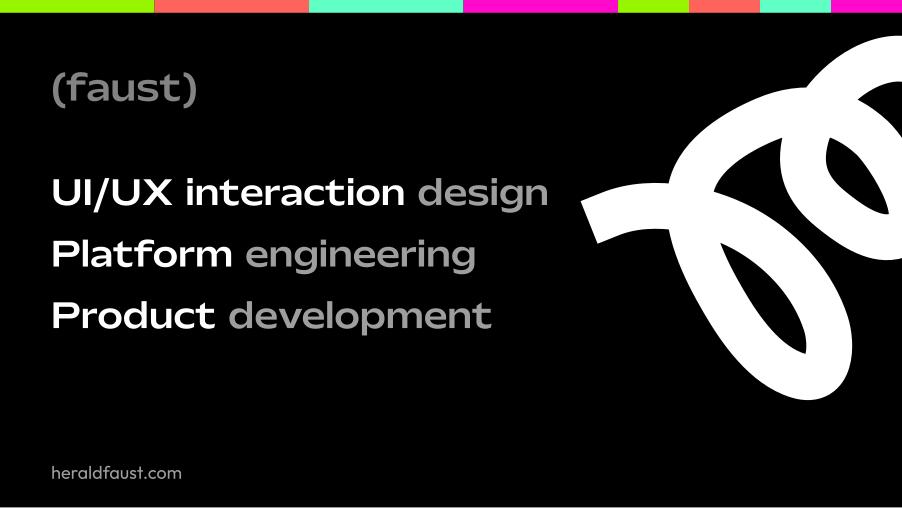

My work sits at the intersection of STEM, abstraction, and capital. I write, design and engineer systems that are complex, as they are useful.

At mypursepay, we built next-gen payments infrastructures, and engineered financial systems for global use - personal, business, and community. Everything from fiat, crypto, utilities, escrow, and the mechanics of modern economics and it's ever-changing syntaxes - I have successfully privatized the fintech definition.

I believe consumer technology should be humanely intelligent, aesthetic, and again, aesthetic - I cannot stress that enough.

My philosophy on work :

A critical step towards creating anything that is as useful as it is intended, is understanding what it is, and communicating it to the right facilitator. Ideas managed by the wrong agent is as destructive as miscommunication. I understand this, and have come to be pragmatic : No useful project, with the privilege of good enforce in resources should be facilitated by people who are not experienced enough, creative enough, technical enough, and attentive enough, to get the job done. To that philosophy I hold my professional career.

I love cats, porches, and women on red.

You can reach me at heraldfaust@gmail.com

# Gear

     

          
                                   
          
  

